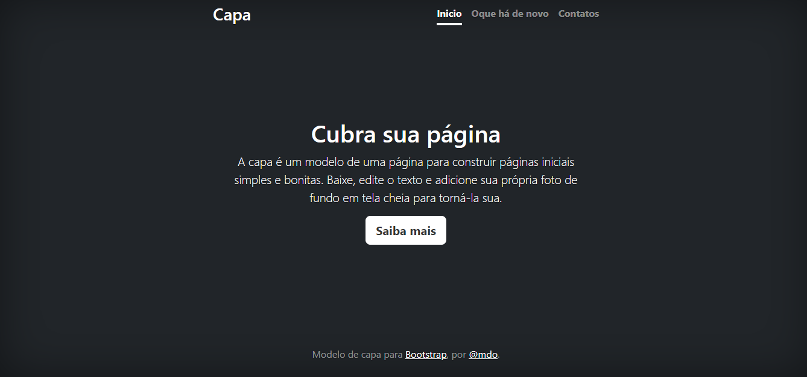

# Índice

* [Projeto - Portifólio para escrita do README](#projeto---portif%C3%B3lio-para-escrita-do-readme)
* [Descrição](#descri%C3%A7%C3%A3o)
* [Funcionalidades](#funcionalidade)
* [Tecnologias utilizadas](#tecnologias-utilizadas)
* [Fontes consultadas](#fontes-consultadas)
* [Autores](#autores)

 
# Projeto - Portifólio para escrita do README

* [Voltar para o Índice](#%C3%ADndice)

 
## Descrição
* Este é um modelo de página inicial simples e bonita, feito para voce utilizar em seus projetos. Com um design limpo e moderno, esta página proporcionará uma experiência agradável aos visitantes.
* [Voltar para o Índice](#%C3%ADndice)

 
## Funcionalidade
* Contato, home e oque há de novo.
* [Voltar para o Índice](#%C3%ADndice)

 
### Tecnologias utilizadas
* Git
* Git Hub
* Visual Estudio Code
* Html, Css, Bootstrap
* [Voltar para o Índice](#%C3%ADndice)

 
## Fontes consultadas
* Alura
* Git Hub
* Bootstrap
* [Voltar para o Índice](#%C3%ADndice)

 
## Autores
* Daniiekkk
* [Voltar para o Índice](#%C3%ADndice)
